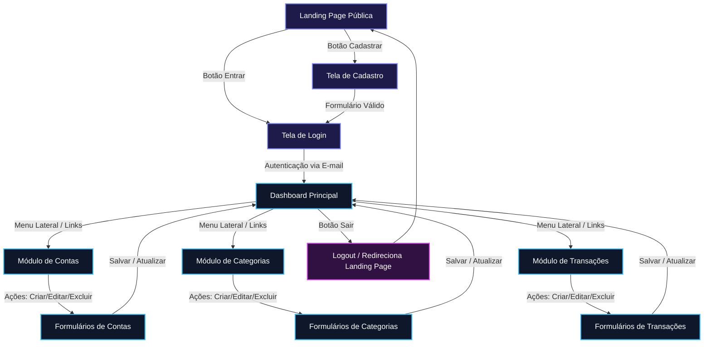
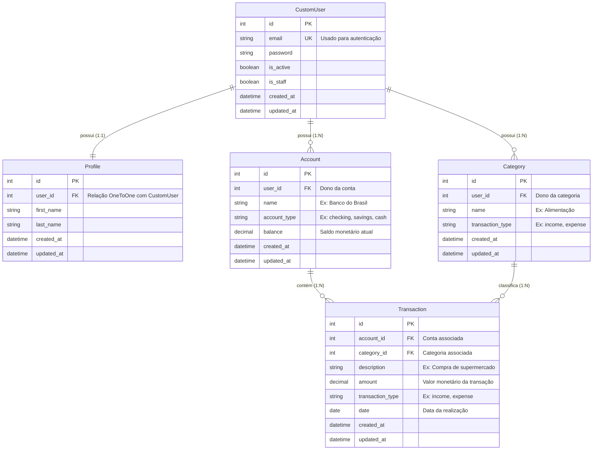

# Documento de Requisitos de Produto (PRD) - Finanpy

## 1. Visão Geral
O **Finanpy** é um sistema full-stack de gestão de finanças pessoais desenvolvido em Python e Django. O foco principal do projeto é a simplicidade e a eficiência, evitando qualquer tipo de *over-engineering*. Ele oferece aos usuários uma interface moderna, responsiva, com tema escuro e elementos visuais sofisticados (como gradientes de cores), permitindo o controle completo de suas contas bancárias, categorias personalizadas e lançamentos financeiros (entradas e saídas). Toda a experiência do usuário (UI) é adaptada para o português brasileiro, enquanto o código-fonte segue estritamente padrões internacionais em inglês e as diretrizes de estilo da PEP8, utilizando sempre aspas simples (`'`).

## 2. Sobre o Produto
O Finanpy centraliza o ecossistema financeiro de um indivíduo em uma única plataforma unificada. Utilizando as capacidades nativas do ecossistema Django (Django Template Language e Class-Based Views) combinado com o poder utilitário do TailwindCSS, o produto entrega uma experiência fluida sem a complexidade de frameworks JavaScript modernos (como React ou Vue). O sistema possui uma área pública institucional para atração de novos usuários e uma área autenticada robusta onde ocorre a gestão financeira propriamente dita.

## 3. Propósito
O propósito do Finanpy é democratizar e simplificar a organização financeira pessoal através de uma ferramenta ágil, visualmente atraente e extremamente direta. O projeto serve como um modelo de desenvolvimento limpo, priorizando recursos nativos do Django e provando que aplicações completas, seguras e escaláveis podem ser construídas de forma enxuta, sem dependências desnecessárias ou arquiteturas infladas.

## 4. Público-Alvo
* Indivíduos que buscam uma ferramenta minimalista e direta para controle de gastos diários, sem excesso de relatórios complexos ou integrações bancárias automáticas confusas.
* Usuários entusiastas de tecnologia e design que preferem interfaces escuras (*dark mode*) modernas, fluidas e otimizadas para dispositivos móveis e desktops.
* Pessoas que necessitam categorizar seus gastos e receitas de forma customizada para entender para onde seu dinheiro está indo no final do mês.

## 5. Objetivos
* **Simplicidade Arquitetural:** Desenvolver o sistema utilizando puramente a stack padrão do Django (SQLite, DTL, CBVs) sem APIs REST isoladas ou microsserviços.
* **Identidade Visual Unificada:** Implementar um Design System coeso com TailwindCSS focado em um ambiente de fundo escuro e gradientes harmônicos que se repetem por todo o ecossistema.
* **Autenticação Segura por E-mail:** Substituir o padrão de login por `username` do Django para autenticação direta por `email`, alinhando-se às práticas modernas de UX.
* **Entrega Incremental:** Estruturar o desenvolvimento em Sprints bem delimitadas, adiando testes automatizados e containerização (Docker) para as fases finais de refatoração e polimento.

## 6. Requisitos Funcionais

### RF-001: Landing Page Pública
* O sistema deve exibir uma página inicial institucional pública de apresentação do produto.
* Deve conter links visíveis para as telas de 'Cadastre-se' e 'Login'.

### RF-002: Autenticação de Usuários
* O sistema deve permitir que novos usuários se cadastrem informando e-mail, nome, sobrenome e senha.
* O login deve ser efetuado exclusivamente através da combinação de **E-mail** e **Senha**.
* O sistema deve permitir a desconexão do usuário (Logout) a partir de qualquer tela autenticada.

### RF-003: Dashboard Principal
* Após o login com sucesso, o usuário deve ser redirecionado para o Dashboard Principal.
* O Dashboard deve apresentar o saldo consolidado (soma de todas as contas), total de receitas do mês atual, total de despesas do mês atual e uma listagem das últimas transações realizadas.

### RF-004: Gestão de Contas Bancárias (`accounts`)
* O usuário deve poder cadastrar suas contas (ex: 'Carteira', 'Banco X', 'Investimentos').
* Campos obrigatórios: Nome da Conta, Tipo de Conta (Corrente, Poupança, Dinheiro) e Saldo Inicial.
* Deve ser possível visualizar, editar e excluir uma conta existente.

### RF-005: Gestão de Categorias (`categories`)
* O usuário deve poder criar categorias customizadas para classificar seus fluxos (ex: 'Alimentação', 'Salário', 'Lazer').
* Campos obrigatórios: Nome da Categoria e Tipo (Entrada ou Saída).
* Deve ser possível visualizar, editar e excluir uma categoria existente.

### RF-006: Gestão de Transações (`transactions`)
* O usuário deve poder lançar movimentações financeiras vinculadas a uma Conta e a uma Categoria.
* Campos obrigatórios: Descrição, Valor, Tipo (Entrada/Receita ou Saída/Despesa), Data da Transação, Conta Vinculada e Categoria Vinculada.
* Ao cadastrar ou deletar uma transação, o saldo da conta associada deve ser atualizado de forma correspondente.

### RF-007: Perfil do Usuário (`profiles`)
* O sistema deve manter um registro de perfil atrelado ao usuário para armazenar dados complementares, garantindo isolamento da lógica de autenticação.

---

### Flowchart de UX (Mermaid)



## 7. Requisitos Não-Funcionais

### RNF-001: Stack e Simplicidade
* O projeto deve ser construído utilizando Python e Django Full Stack (sem APIs separadas, usando o ecossistema interno).
* O banco de dados deve ser unicamente o **SQLite** nativo, sem necessidade de configuração de servidores externos de banco de dados.

### RNF-002: Padrão de Código e Estilo
* Todo o código-fonte deve ser escrito em **Inglês** (nomes de variáveis, classes, models, views, commits, documentação interna).
* O código deve seguir estritamente as diretrizes da **PEP8**.
* Devem ser utilizadas **aspas simples (`'`)** em strings e declarações em todo o projeto, exceto onde a sintaxe exigir aspas duplas.
* Devem ser utilizadas **Class Based Views (CBVs)** nativas do Django (`ListView`, `CreateView`, `UpdateView`, `DeleteView`, `TemplateView`) para manter o padrão enxuto e reutilizável.

### RNF-003: Interface com o Usuário (UI/UX)
* Toda a interface visível ao usuário final deve estar em **Português Brasileiro (pt-BR)**.
* O design deve ser obrigatoriamente **responsivo** (Mobile-first ou adaptável de forma fluida para resoluções menores).
* O fundo de todas as telas autenticadas e públicas deve ser **escuro** (Paleta Dark).
* A interface deve utilizar o utilitário **TailwindCSS** carregado de forma limpa, garantindo a homogeneidade visual.

### RNF-004: Auditoria de Dados
* Toda e qualquer tabela/model criada no banco de dados deve obrigatoriamente herdar ou possuir os campos de auditoria temporal: `created_at` (DateTime de criação, com `auto_now_add=True`) e `updated_at` (DateTime de atualização, com `auto_now=True`).

### RNF-005: Ciclo de Vida do Projeto
* Ambientes de isolamento como Docker e testes automatizados (`tests.py`) estão fora do escopo inicial e só serão implementados nas Sprints finais de consolidação.

## 8. Arquitetura Técnico

### Stack Tecnológica
* **Linguagem:** Python
* **Framework Web:** Django (Full Stack)
* **Engine de Template:** Django Template Language (DTL)
* **Estilização & Design:** TailwindCSS
* **Banco de Dados:** SQLite

### Estrutura de Dados (Database Schema - Mermaid ERD)



## 9. Design System (TailwindCSS & Django Templates)

Para garantir uma identidade visual totalmente coesa, moderna e harmoniosa em modo escuro, fica estabelecido o seguinte conjunto de classes utilitárias do TailwindCSS. Nenhum outro padrão de cor fora deste escopo deve ser misturado aleatoriamente no HTML.

### Paleta de Cores e Fundo
* **Fundo Geral da Aplicação (`Background`):** `bg-slate-900` ou `bg-neutral-950`
* **Fundo de Superfície / Cards / Modais:** `bg-slate-800/60` com bordas `border border-slate-700/50`.
* **Gradiente Primário da Marca (Usado em banners, botões principais e destaques):** `bg-gradient-to-r from-violet-600 via-indigo-600 to-cyan-500`
* **Texto Principal (`Text Primary`):** `text-slate-100` ou `text-white`
* **Texto Secundário (`Text Secondary`):** `text-slate-400`
* **Cores de Status (Financeiro):**
    * *Entradas/Receitas:* `text-emerald-400` / `bg-emerald-500/10`
    * *Saídas/Despesa:* `text-rose-400` / `bg-rose-500/10`

### Padrão de Componentes HTML (Sintaxe DTL com aspas simples)

#### 1. Tipografia e Fontes
A aplicação utilizará a pilha de fontes sans-serif nativa otimizada (`font-sans`), preferencialmente renderizando a fonte Inter do sistema operacional.
```html
<h1 class='text-2xl font-bold tracking-tight text-white sm:text-3xl'>Título da Tela</h1>
<p class='mt-2 text-sm text-slate-400'>Subtítulo explicativo com instruções contextuais.</p>
```

#### 2. Botão Primário (Com Gradiente Harmônico)
```html
<button type='submit' class='inline-flex items-center justify-center px-4 py-2 text-sm font-medium text-white bg-gradient-to-r from-violet-600 to-indigo-600 hover:from-violet-500 hover:to-indigo-500 focus:outline-none focus:ring-2 focus:ring-offset-2 focus:ring-offset-slate-900 focus:ring-indigo-500 rounded-lg transition-all duration-200 shadow-lg shadow-indigo-600/20'>
    Salvar Registro
</button>
```

#### 3. Botão Secundário / Cancelar
```html
<a href='#' class='inline-flex items-center justify-center px-4 py-2 text-sm font-medium text-slate-300 bg-slate-800 hover:bg-slate-700 border border-slate-700 hover:border-slate-600 rounded-lg transition-colors duration-200'>
    Cancelar
</a>
```

#### 4. Inputs e Formulários
Todos os campos de texto do sistema devem seguir este padrão visual para garantir consistência no preenchimento:
```html
<div class='space-y-1'>
    <label for='id_field' class='block text-sm font-medium text-slate-300'>Nome do Campo</label>
    <input type='text' id='id_field' name='field_name' required
           class='block w-full px-3 py-2 bg-slate-800/80 border border-slate-700 rounded-lg text-slate-100 placeholder-slate-500 focus:outline-none focus:ring-2 focus:ring-indigo-500 focus:border-indigo-500 text-sm transition-colors duration-150'
           placeholder='Ex: Digite a informação aqui...'>
</div>
```

#### 5. Layout Estrutural (Grid e Menu Lateral)
Todas as telas autenticadas compartilham a mesma estrutura de casca (*Shell*), com um menu de navegação lateral esquerdo fixo e a área de conteúdo à direita.
```html
<div class='min-h-screen bg-slate-900 text-slate-100 font-sans antialiased block md:table w-full'>
    <div class='md:table-row w-full'>
        <aside class='w-full md:table-cell md:w-64 bg-slate-950 border-b md:border-b-0 md:border-r border-slate-800 p-6 vertical-align-top'>
            <div class='flex items-center space-x-3 mb-8'>
                <div class='h-8 w-8 rounded-lg bg-gradient-to-tr from-violet-600 to-cyan-500 flex items-center justify-center font-bold text-white tracking-wider'>F</div>
                <span class='text-xl font-black bg-clip-text text-transparent bg-gradient-to-r from-white to-slate-400'>Finanpy</span>
            </div>
            <nav class='space-y-1'>
                <a href='#' class='flex items-center px-3 py-2.5 text-sm font-medium rounded-lg bg-slate-800 text-white transition-colors'>Dashboard</a>
                <a href='#' class='flex items-center px-3 py-2.5 text-sm font-medium rounded-lg text-slate-400 hover:bg-slate-800/50 hover:text-white transition-colors'>Contas</a>
                <a href='#' class='flex items-center px-3 py-2.5 text-sm font-medium rounded-lg text-slate-400 hover:bg-slate-800/50 hover:text-white transition-colors'>Categorias</a>
                <a href='#' class='flex items-center px-3 py-2.5 text-sm font-medium rounded-lg text-slate-400 hover:bg-slate-800/50 hover:text-white transition-colors'>Transações</a>
            </nav>
        </aside>

        <main class='w-full md:table-cell p-6 md:p-8 vertical-align-top'>
            <div class='max-w-7xl mx-auto space-y-6'>
                </div>
        </main>
    </div>
</div>
```

## 10. User Stories (Histórias de Usuário)

### Épico 1: Autenticação Moderna e Acesso Autenticado
**História de Usuário:** Como um usuário interessado na plataforma, quero me cadastrar e efetuar login usando meu e-mail para acessar com segurança o painel financeiro sem precisar lembrar de um nome de usuário arbitrário.

#### Critérios de Aceite:
* A tentativa de login informando um `username` clássico do Django deve ser impossível; apenas o campo `email` deve ser aceito como identificador único.
* A senha deve ser armazenada com criptografia nativa forte do Django.
* Ao se registrar, o sistema deve criar automaticamente a instância correspondente do usuário e o seu perfil (`profiles`).
* Caso um e-mail já cadastrado tente se registrar novamente, um erro claro em português deve ser exibido.
* Tentativas de acessar o Dashboard ou qualquer rota interna sem estar logado devem redirecionar imediatamente para a tela de Login.

### Épico 2: Gestão de Fluxos e Saldos Financeiros
**História de Usuário:** Como um usuário autenticado, quero cadastrar minhas contas e meus lançamentos de despesas e receitas para ver o impacto direto e em tempo real sobre os meus saldos financeiros consolidados.

#### Critérios de Aceite:
* Ao adicionar uma transação do tipo despesa (`expense`), o valor deve ser subtraído do saldo total da conta bancária vinculada.
* Ao adicionar uma transação do tipo receita (`income`), o valor deve ser somado ao saldo total da conta bancária vinculada.
* Se uma transação for removida, o saldo da conta deve reverter o impacto gerado exatamente pelo montante original daquela transação.
* As visualizações em tabelas devem colorir transações de receita com tonalidades verdes (`text-emerald-400`) e despesas com tons vermelhos (`text-rose-400`).

## 11. Métricas de Sucesso (KPIs)
Para validar a adoção do produto e o bom comportamento técnico da aplicação, os seguintes indicadores serão observados:
1.  **KPI de Retenção de Usuários:** Percentual de usuários que realizam pelo menos 3 lançamentos semanais após o cadastro inicial.
2.  **KPI de Performance de Página:** Tempo médio de carregamento de páginas da área logada (`Dashboard` e `Transactions`) abaixo de 400ms, viabilizado pelo uso de consultas otimizadas no SQLite.
3.  **KPI de Erros de Operação:** Índice de erros HTTP 500 ou quebras de integridade de banco de dados (como orfandade de registros financeiros) mantido em 0%.

## 12. Riscos e Mitigações

* **Risco 1: Concorrência e Conflitos de Escrita no SQLite:** Sendo um banco baseado em arquivo único, cenários de concorrência massiva de acessos simultâneos podem gerar travamentos por *database locked*.
    * *Mitigação:* O Finanpy foi desenhado estritamente como um MVP pessoal e enxuto. O uso de timeouts de conexão configurados no Django settings e índices adequados mitigam completamente a concorrência em baixa/média escala.
* **Risco 2: Complexidade na Atualização de Saldos:** Atualizar o saldo da conta calculando de forma manual e espalhada pelas views pode gerar divergências de saldo quando transações forem editadas ou apagadas.
    * *Mitigação:* Isolar estritamente a recomputação ou centralizá-la usando métodos específicos do Model ou concentrando regras em `signals.py` dedicado dentro de `transactions`, garantindo atomicidade na transação do banco.

## 13. Lista de Tarefas (Sprints Detalhadas)

### Sprint 1: Setup Inicial, Arquitetura de Apps e Custom User (Foco: Core & Users)

#### Tarefa 1.1: Inicialização do Projeto e Configurações PEP8
* [x] **Subtarefa 1.1.1:** Criar o diretório do projeto `finanpy` e executar `django-admin startproject core .` para centralizar as configurações globais.
* [ ] **Subtarefa 1.1.2:** Configurar o arquivo `core/settings.py` para usar exclusivamente o banco de dados `db.sqlite3` no diretório raiz.
* [ ] **Subtarefa 1.1.3:** Ajustar as variáveis de localização no `settings.py` para `LANGUAGE_CODE = 'pt-br'` e `TIME_ZONE = 'America/Sao_Paulo'`.
* [ ] **Subtarefa 1.1.4:** Adicionar suporte a arquivos estáticos básicos configurando as variáveis `STATIC_URL` e `STATICFILES_DIRS` usando aspas simples.

#### Tarefa 1.2: Criação e Estruturação das Apps do Projeto
* [x] **Subtarefa 1.2.1:** Criar a aplicação de usuários executando `python manage.py startapp users`.
* [x] **Subtarefa 1.2.2:** Criar a aplicação de perfis executando `python manage.py startapp profiles`.
* [x] **Subtarefa 1.2.3:** Criar a aplicação de contas bancárias executando `python manage.py startapp accounts`.
* [x] **Subtarefa 1.2.4:** Criar a aplicação de categorias executando `python manage.py startapp categories`.
* [x] **Subtarefa 1.2.5:** Criar a aplicação de transações executando `python manage.py startapp transactions`.
* [x] **Subtarefa 1.2.6:** Registrar todas as 5 apps recém-criadas na lista de `INSTALLED_APPS` dentro do arquivo `core/settings.py` usando formatação padronizada com aspas simples.

#### Tarefa 1.3: Implementação do Custom User Model por E-mail
* [ ] **Subtarefa 1.3.1:** No arquivo `users/models.py`, criar a classe `User` herdando de `AbstractUser` do Django.
* [ ] **Subtarefa 1.3.2:** Remover o campo `username` adicionando `username = None`. Definir `email = models.EmailField(unique=True)` como campo obrigatório e chave de identificação.
* [ ] **Subtarefa 1.3.3:** Definir a propriedade `USERNAME_FIELD = 'email'` e limpar a lista de `REQUIRED_FIELDS` para não exigir nome de usuário.
* [ ] **Subtarefa 1.3.4:** Adicionar os campos obrigatórios de auditoria global `created_at = models.DateTimeField(auto_now_add=True)` e `updated_at = models.DateTimeField(auto_now=True)` à classe `User`.
* [ ] **Subtarefa 1.3.5:** Criar um gerenciador customizado `UserManager` herdando de `BaseUserManager` que sobrescreva os métodos `create_user` e `create_superuser` para usar o e-mail como chave principal de login.
* [ ] **Subtarefa 1.3.6:** Declarar `AUTH_USER_MODEL = 'users.User'` no arquivo `core/settings.py`.
* [ ] **Subtarefa 1.3.7:** Rodar os comandos `python manage.py makemigrations users` e `python manage.py migrate` para consolidar o banco inicial.

#### Tarefa 1.4: Criação do Modelo de Perfil (`profiles`)
* [ ] **Subtarefa 1.4.1:** No arquivo `profiles/models.py`, importar o modelo de usuário configurado.
* [ ] **Subtarefa 1.4.2:** Criar a classe `Profile` com uma relação de `models.OneToOneField` apontando para o modelo de usuário, definindo `on_delete=models.CASCADE`.
* [ ] **Subtarefa 1.4.3:** Adicionar os campos `first_name = models.CharField(max_length=100)`, `last_name = models.CharField(max_length=100)`, além dos campos obrigatórios de auditoria `created_at` e `updated_at`.
* [ ] **Subtarefa 1.4.4:** Criar o arquivo `profiles/signals.py`. Escrever uma função receptora conectada ao sinal `post_save` do modelo de usuário para instanciar e salvar automaticamente um `Profile` toda vez que um novo usuário for criado.
* [ ] **Subtarefa 1.4.5:** Sobrescrever o método `ready` dentro da classe `ProfilesConfig` em `profiles/apps.py` para importar e registrar as escutas do arquivo `signals.py`.
* [ ] **Subtarefa 1.4.6:** Gerar as migrações e aplicar as alterações no banco de dados.

---

### Sprint 2: Frontend Base, Design System com Tailwind e Telas Públicas (Foco: Core UI & Auth Views)

#### Tarefa 2.1: Estruturação dos Templates Globais e Integração do Tailwind
* [ ] **Subtarefa 2.1.1:** Criar um diretório unificado de templates na raiz (`templates/`) e registrá-lo no bloco `TEMPLATES` do `settings.py`.
* [ ] **Subtarefa 2.1.2:** Criar o arquivo de layout base `base.html` que servirá de esqueleto para o sistema todo.
* [ ] **Subtarefa 2.1.3:** Adicionar no `<head>` do `base.html` a importação do script utilitário do TailwindCSS e configurar a tag meta de viewport para garantir total responsividade.
* [ ] **Subtarefa 2.1.4:** Aplicar a classe de fundo escuro imutável `bg-slate-900` e cor de texto `text-slate-100` diretamente na tag `<body>` do `base.html`.
* [ ] **Subtarefa 2.1.5:** Inserir os blocos estruturais do DTL: `` no corpo da página para renderização dinâmica pelas views filhas.

#### Tarefa 2.2: Implementação da Landing Page Pública
* [ ] **Subtarefa 2.2.1:** Criar uma Class Based View baseada em `TemplateView` chamada `LandingPageView`.
* [ ] **Subtarefa 2.2.2:** Criar o template `landing.html` herdando de `base.html`.
* [ ] **Subtarefa 2.2.3:** Estilizar a Landing Page seguindo o Design System: incluir um cabeçalho simples com a logo fictícia "Finanpy", uma seção hero central chamativa com textos grandes explicando o app em português e um gradiente vívido (`bg-gradient-to-r from-violet-600 via-indigo-600 to-cyan-500`).
* [ ] **Subtarefa 2.2.4:** Adicionar dois botões principais com estilo elegante que apontem para os fluxos de login e de cadastro de novos usuários.
* [ ] **Subtarefa 2.2.5:** Mapear a URL raiz do projeto em `core/urls.py` para carregar a `LandingPageView`.

#### Tarefa 2.3: Fluxo de Cadastro e Login de Usuários (Interface e Views)
* [ ] **Subtarefa 2.3.1:** Criar uma view de cadastro utilizando `CreateView` combinada com um formulário customizado `UserCreationForm` adaptado para receber o e-mail em primeiro plano.
* [ ] **Subtarefa 2.3.2:** Criar o template `register.html` contendo um card centralizado com fundo `bg-slate-800/60`, bordas suaves e inputs estilizados conforme o padrão definido no Design System.
* [ ] **Subtarefa 2.3.3:** Criar a view de login herdando da classe nativa do Django `LoginView`.
* [ ] **Subtarefa 2.3.4:** Criar o template `login.html` replicando a mesma estética de inputs escuros e botão largo dotado de gradiente roxo/azul.
* [ ] **Subtarefa 2.3.5:** Configurar em `core/settings.py` as diretrizes `LOGIN_REDIRECT_URL = 'dashboard'` e `LOGOUT_REDIRECT_URL = 'landing'` para guiar o fluxo nativo.
* [ ] **Subtarefa 2.3.6:** Criar uma URL de logout associada à view nativa `LogoutView` do Django.

---

### Sprint 3: Gestão de Estruturas Financeiras Auxiliares (Foco: Accounts & Categories)

#### Tarefa 3.1: Modelagem e CRUD de Contas Bancárias (`accounts`)
* [ ] **Subtarefa 3.1.1:** No arquivo `accounts/models.py`, criar a classe `Account` contendo relacionamento de chave estrangeira (`ForeignKey`) para o modelo de usuário.
* [ ] **Subtarefa 3.1.2:** Adicionar os campos `name = models.CharField(max_length=100)`, `account_type = models.CharField(max_length=50)` (Ex: Corrente, Poupança, Dinheiro) e `balance = models.DecimalField(max_length=12, decimal_places=2, default=0.00)`.
* [ ] **Subtarefa 3.1.3:** Incluir as colunas obrigatórias de auditoria temporal `created_at` e `updated_at`.
* [ ] **Subtarefa 3.1.4:** Desenvolver as Class Based Views para manipulação da entidade: `AccountListView`, `AccountCreateView`, `AccountUpdateView` e `AccountDeleteView`. Garantir o uso do mixin `LoginRequiredMixin`.
* [ ] **Subtarefa 3.1.5:** Sobrescrever o método `get_queryset` nas views para garantir que o usuário logado visualize e gerencie somente as suas próprias contas bancárias (`self.request.user`).
* [ ] **Subtarefa 3.1.6:** Criar os templates HTML correspondentes dentro da pasta da app estruturados em formato de tabela e formulários limpos envoltos no layout de Menu Lateral unificado.

#### Tarefa 3.2: Modelagem e CRUD de Categorias (`categories`)
* [ ] **Subtarefa 3.2.1:** No arquivo `categories/models.py`, definir a classe `Category` com chave estrangeira direcionada para o usuário logado.
* [ ] **Subtarefa 3.2.2:** Adicionar os atributos `name = models.CharField(max_length=100)` e `transaction_type = models.CharField(max_length=20)` para segmentar se a categoria representa Entradas (`income`) ou Saídas (`expense`).
* [ ] **Subtarefa 3.2.3:** Adicionar as duas colunas padrão de auditoria de data (`created_at`, `updated_at`).
* [ ] **Subtarefa 3.2.4:** Criar o conjunto de visões baseadas em classe: `CategoryListView`, `CategoryCreateView`, `CategoryUpdateView` e `CategoryDeleteView`.
* [ ] **Subtarefa 3.2.5:** Garantir a filtragem de segurança por usuário logado dentro do escopo do método `get_queryset`.
* [ ] **Subtarefa 3.2.6:** Elaborar as telas de listagem e de formulário para inclusão de categorias seguindo o padrão estético de linhas bem espaçadas e inputs com foco colorido em indigo.

---

### Sprint 4: Transações, Sincronização de Saldo e Dashboard Central (Foco: Transactions & Dashboard View)

#### Tarefa 4.1: Criação do Modelo de Transações Financeiras (`transactions`)
* [ ] **Subtarefa 4.1.1:** No arquivo `transactions/models.py`, declarar o modelo `Transaction`.
* [ ] **Subtarefa 4.1.2:** Adicionar chaves estrangeiras vinculando a movimentação a uma conta (`Account`) e a uma categoria (`Category`).
* [ ] **Subtarefa 4.1.3:** Adicionar as propriedades `description = models.CharField(max_length=255)`, `amount = models.DecimalField(max_length=12, decimal_places=2)`, `transaction_type = models.CharField(max_length=20)` e `date = models.DateField()`.
* [ ] **Subtarefa 4.1.4:** Adicionar os campos padronizados de auditoria temporal `created_at` e `updated_at`.
* [ ] **Subtarefa 4.1.5:** Gerar arquivos de migração via terminal e executar as migrações para refletir as tabelas finais no arquivo SQLite.

#### Tarefa 4.2: Lógica de Sincronização de Saldos Automatizada (Signals)
* [ ] **Subtarefa 4.2.1:** Criar o arquivo `transactions/signals.py` focado no isolamento de responsabilidades.
* [ ] **Subtarefa 4.2.2:** Implementar uma função receptora ligada ao sinal `post_save` do modelo `Transaction`. Se for um registro novo e o tipo for entrada (`income`), o saldo da conta vinculada deve somar o valor. Se for saída (`expense`), o saldo deve subtrair o valor.
* [ ] **Subtarefa 4.2.3:** Incrementar a lógica do sinal para tratar adequadamente atualizações de registros (edição do valor) e reversão total de saldos em caso de disparo do sinal `post_delete`.
* [ ] **Subtarefa 4.2.4:** Registrar o arquivo de sinais modificando o método `ready` em `transactions/apps.py` para garantir a ativação automática dos gatilhos em tempo de execução.

#### Tarefa 4.3: CRUD de Transações e Telas de Lançamento
* [ ] **Subtarefa 4.3.1:** Construir as visões `TransactionListView`, `TransactionCreateView`, `TransactionUpdateView` e `TransactionDeleteView` herdando de suas respectivas CBVs nativas.
* [ ] **Subtarefa 4.3.2:** Customizar os formulários de inserção para que os campos de seleção (Dropdowns) de Conta e Categoria mostrem unicamente as instâncias pertencentes ao usuário que está operando o sistema.
* [ ] **Subtarefa 4.3.3:** Montar o template de listagem exibindo um histórico claro. Aplicar as classes condicionais do Tailwind: se a transação for receita, formatar o texto com `text-emerald-400`; se for despesa, formatar com `text-rose-400`. Preencher valores monetários com o cifrão adequado em português brasileiro (R$).

#### Tarefa 4.4: Consolidação do Dashboard Principal
* [ ] **Subtarefa 4.4.1:** Criar uma Class Based View customizada baseada em `TemplateView` chamada `DashboardView`.
* [ ] **Subtarefa 4.4.2:** No método `get_context_data`, realizar queries agregadas de soma utilizando funções nativas do Django (`django.db.models.Sum`) para calcular o saldo consolidado de todas as contas do usuário, o somatório total de entradas e o somatório total de saídas registradas no mês corrente.
* [ ] **Subtarefa 4.4.3:** Buscar os últimos 5 ou 10 lançamentos ordenados por data decrescente para alimentar a lista de atividades recentes do painel.
* [ ] **Subtarefa 4.4.4:** Criar o template `dashboard.html` incorporando blocos de destaque visual (Cards com gradientes discretos) para exibir os totais financeiros e uma listagem de resumo rápido, tudo perfeitamente enquadrado na estrutura padrão de fundo escuro.

---

### Sprint 5: Refinação de Código, Testes Automatizados e Dockerização (Foco: Quality Assurance & Deploys Finais)

#### Tarefa 5.1: Cobertura de Testes Automatizados
* [ ] **Subtarefa 5.1.1:** No arquivo `users/tests.py`, escrever testes unitários cobrindo o comportamento do Custom User Model (Criação de usuário comum por e-mail e criação de superusuário).
* [ ] **Subtarefa 5.1.2:** No arquivo `accounts/tests.py`, testar o isolamento de registros por usuário.
* [ ] **Subtarefa 5.1.3:** No arquivo `transactions/tests.py`, escrever testes integrados para validar se os Signals estão incrementando e decrementando o saldo das contas de forma precisa durante a criação, edição e deleção de lançamentos.
* [ ] **Subtarefa 5.1.4:** Executar o comando geral `python manage.py test`.

#### Tarefa 5.2: Containerização Inicial com Docker
* [ ] **Subtarefa 5.2.1:** Criar um arquivo `Dockerfile` na raiz do projeto Finanpy utilizando a imagem oficial estável do Python Slim.
* [ ] **Subtarefa 5.2.2:** Configurar variáveis de ambiente do Python (`PYTHONDONTWRITEBYTECODE=1` e `PYTHONUNBUFFERED=1`).
* [ ] **Subtarefa 5.2.3:** Adicionar os comandos para instalação das dependências declaradas no `requirements.txt`.
* [ ] **Subtarefa 5.2.4:** Criar um arquivo `docker-compose.yml` simplificado que instancie o serviço web local, exponha a porta padrão `8000`, mapeie os volumes locais e monte o banco de dados SQLite de forma permanente.
* [ ] **Subtarefa 5.2.5:** Executar testes de subida do ambiente através do utilitário `docker compose up --build`.

#### Tarefa 5.3: Revisão Geral, Limpeza de Código e Entrega do MVP
* [ ] **Subtarefa 5.3.1:** Auditar exaustivamente o código em busca de strings declaradas incorretamente, garantindo o uso universal de aspas simples (`'`).
* [ ] **Subtarefa 5.3.2:** Rodar um linter de código para comprovar a conformidade absoluta do código em inglês com as diretrizes da PEP8.
* [ ] **Subtarefa 5.3.3:** Realizar um test manual ponta-a-ponta (Cadastro -> Login -> Criação de Contas -> Criação de Categorias -> Lançamento de Transações -> Validação de Saldo no Dashboard -> Logout) certificando-se de que nenhum texto em inglês seja exposto para o usuário final na interface brasileira.