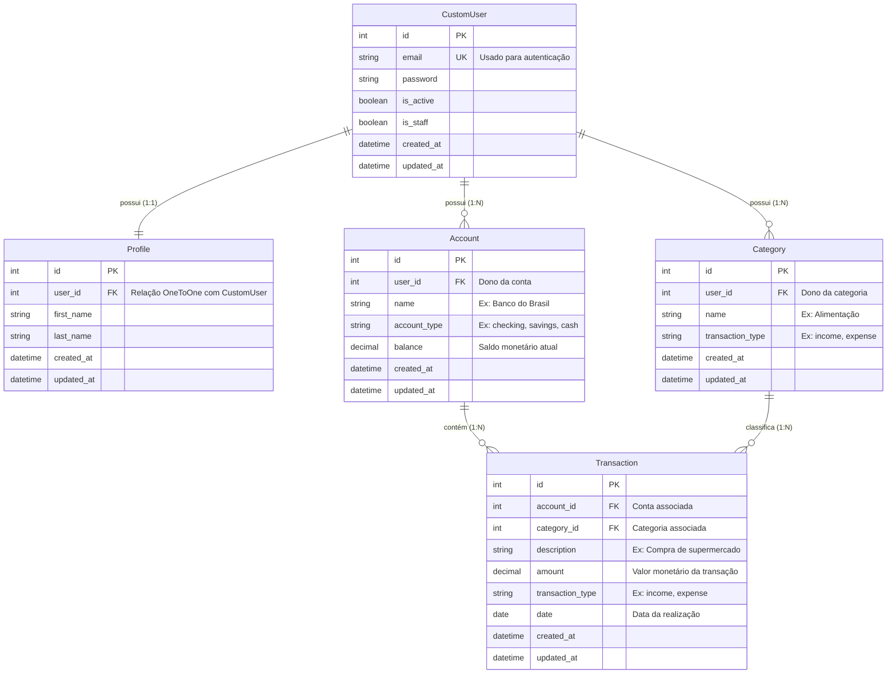

# Banco de Dados

## Tecnologia

- **SGBD:** SQLite nativo (`django.db.backends.sqlite3`).
- **Arquivo:** `db.sqlite3` na raiz do projeto.
- **Configuração:** definida em `core/settings.py` como `BASE_DIR / 'db.sqlite3'`.
- Não é necessário nenhum servidor externo de banco de dados.

## Convenções globais

### Auditoria temporal (obrigatória)

**Toda** tabela criada no projeto precisa incluir os dois campos:

```python
created_at = models.DateTimeField(auto_now_add=True)
updated_at = models.DateTimeField(auto_now=True)
```

Esses campos não são opcionais — fazem parte do contrato de dados do Finanpy.

### Isolamento por usuário

Toda entidade pertencente a um usuário (`Account`, `Category`, e indiretamente `Transaction`) deve carregar a referência ao dono via `ForeignKey` para o `User`. As views filtram explicitamente por `self.request.user` para garantir isolamento.

## Schema (ERD)

Diagrama de entidades e relacionamentos esperado para o domínio do Finanpy (extraído da seção 8 do PRD):



## Resumo das entidades

| Entidade | Chave | Relação |
|----------|-------|---------|
| `CustomUser` | `email` (único) | 1:1 com `Profile`; 1:N com `Account` e `Category`. |
| `Profile` | `user` (OneToOne) | Estende `CustomUser`. |
| `Account` | `user` (FK) | Possui várias `Transaction`. |
| `Category` | `user` (FK) | Classifica várias `Transaction`. |
| `Transaction` | `account` (FK), `category` (FK) | Movimenta o `balance` da `Account` via signal. |

## Sincronização de saldo

A coluna `Account.balance` é atualizada automaticamente por **signals** definidos em `transactions/signals.py`:

| Sinal | Ação |
|-------|------|
| `post_save` (novo) | Soma `amount` se `income`; subtrai se `expense`. |
| `post_save` (edição) | Reverte o impacto anterior e aplica o novo. |
| `post_delete` | Reverte o impacto da transação removida. |

Isso isola toda regra financeira em um único lugar e evita inconsistências espalhadas pelas views.

## Migrações

- Cada app possui sua própria pasta `migrations/` (já criada).
- Após qualquer alteração em `models.py`:

```bash
python manage.py makemigrations <app>
python manage.py migrate
```

## Riscos conhecidos

- **Concorrência no SQLite:** sob acessos massivos simultâneos, podem ocorrer travamentos (`database locked`). Mitigação: como o Finanpy é um MVP pessoal, timeouts de conexão e índices adequados resolvem o problema na escala alvo.
- **Divergência de saldos:** se a lógica de atualização do `balance` for replicada nas views, pode haver inconsistência. Mitigação: a regra **deve** viver exclusivamente em `transactions/signals.py`.
